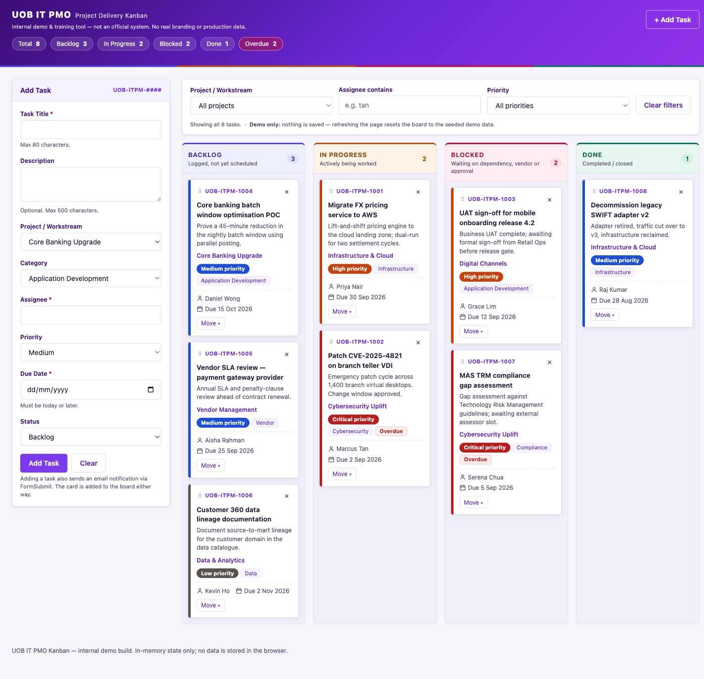

# IT Project Management — Kanban Board

A single-page Kanban board for tracking IT project tasks. Everything — markup,
styles and behaviour — lives in one `index.html` file with no dependencies, no
build step and no server.

**Live demo → https://photonalpha.github.io/itprojectmanagement/**



> This is an internal demo / training tool, not a product. The "UOB IT PMO"
> heading is a plain text wordmark: the project uses no real UOB logos or
> trademarks and does not imitate an official UOB system.

## Running it

Download `index.html` and double-click it. That is the whole setup — it runs
straight from `file://`.

```bash
open index.html
```

A local server is only needed for browser automation, which cannot open
`file://` URLs:

```bash
python3 -m http.server 8765
```

## Features

- **Four-column board** — Backlog, In Progress, Blocked, Done, each with a live
  count that reflects the current filter.
- **Drag and drop** between columns, with a highlighted drop target.
- **Keyboard fallback** — every card carries a `Move ▸` menu, so the board is
  fully usable without a pointer.
- **Task fields** — title, description, project/workstream, category, assignee,
  priority, due date and status. Tasks get sequential `UOB-ITPM-####` ids.
- **Priority pills** — Critical, High, Medium, Low. Colour is never the only
  signal; each pill carries its own text.
- **Due-date awareness** — dates are compared in local time, so "overdue" agrees
  with the date the user actually sees in the picker.
- **Filtering** by project, assignee and priority. Column badges show the
  filtered counts while the header summary always reflects every task.
- **Inline validation and deletion** — errors render under the field they belong
  to, and deleting a card uses an inline "Delete? Yes / No" row. No `alert()` or
  `confirm()` anywhere.
- **Email notification** on task creation via FormSubmit's AJAX endpoint,
  fired so that a network failure can never break the board, and abandoned
  after 10s so a hung request cannot leave the form stuck on "Sending…".
- **Colour-coded columns** — a violet brand with a distinct hue per status
  (indigo Backlog, amber In Progress, rose Blocked, emerald Done) carried
  through each column's accent bar, tinted header, count badge and drop
  highlight, so the destination of a drag is named by colour rather than by a
  generic glow. Every text/background pairing in the palette was measured
  against WCAG AA (4.5:1), and colour is never the only signal — every status
  keeps its label and every priority pill its own text.
- **Inline SVG icons** rather than emoji, which render as a different glyph on
  every platform and are announced as words ("bust in silhouette") by screen
  readers.

## Security

The page is static and has no backend, accounts or stored data, so the interesting
surface is small: rendered task text, the drag-and-drop payload, and the single
outbound request. Each is handled at the sink rather than trusted on arrival:

- **Content Security Policy** (`<meta http-equiv>`) starts from `default-src 'none'`
  and re-opens only the inline script/style, the data-URI favicon and the one
  FormSubmit origin. `connect-src` makes the "no external resources" rule
  browser-enforced instead of review-enforced: any other request is blocked
  outright. `form-action 'none'` stops a native form submit from navigating
  away, and `base-uri 'none'` blocks `<base>` injection.
- **Output escaping** — `renderCard()` builds HTML strings, so every interpolated
  value goes through `escapeHtml()`.
- **Input sanitising** — `sanitizeText()` strips control characters before text is
  stored or sent. This covers the sink escaping does not: the task title is
  interpolated into the FormSubmit email subject, and a CR/LF reaching a mail
  header is the classic header-injection vector.
- **Drop payloads are untrusted** — a drop can carry text dragged from any other
  tab, so the id is shape-checked and an unknown id is a silent no-op.
- **Length and vocabulary limits** are re-checked in JS; `maxlength` and a
  `<select>`'s options are client-side state that anyone can edit.

Not covered, and needing real response headers a static file cannot set:
`frame-ancestors` (clickjacking) and HSTS.

## Tech stack

Vanilla HTML, CSS and JavaScript. No framework, no bundler, no npm, no tests.
Icons are inline SVG or Unicode glyphs; the favicon is an inline data URI. The
only outbound request the page makes is to FormSubmit.

## Architecture

`state` is the single source of truth, holding `tasks`, `filters`, a transient
`ui` object and the id counter. Every mutation goes through `addTask()`,
`moveTask()` or `deleteTask()`, and each one ends by calling `renderBoard()` —
nothing mutates card DOM directly.

The four column shells are static markup; only the list contents and count
badges are rebuilt on render. Drop listeners therefore bind once to the static
columns, while `dragstart` and all card buttons are **delegated** on `#board` so
they survive a re-render. Because re-rendering destroys focus and open menus,
`state.ui` carries the open menu, pending delete confirmation and focus target
across the rebuild.

`renderCard()` builds HTML strings, so every interpolated value passes through
`escapeHtml()`.

## Constraints

These are project requirements rather than preferences. A change that breaks one
breaks the deliverable:

| Constraint | Why it matters |
| --- | --- |
| Vanilla only | No React/Vue/jQuery/Tailwind, no bundler, no npm, no build step |
| One file | Everything stays in `index.html`; no separate `.css` or `.js` |
| Runs from `file://` | Double-clicking the file must work |
| No persistence | No `localStorage`, cookies or IndexedDB — a refresh resetting the board to seed data is intended, and the filter bar says so |
| No external resources | No CDN scripts, web fonts or image files — enforced by the CSP, so adding one fails silently in the browser rather than at review |
| No `alert()` / `confirm()` | Validation and deletion are inline |

Accessibility is part of the spec: `<label for>` on every input, `aria-label` on
icon-only buttons, `aria-live="polite"` on the toast region, and visible focus
rings.

`CLAUDE.md` holds the fuller guidance, including how to sanity-check a change.

## Configuration

`FORMSUBMIT_ENDPOINT` near the top of the script block is the single place the
notification address appears. It currently holds the placeholder
`YOUR_EMAIL@example.com`, so notifications fail into a non-blocking warning
toast until you swap it. FormSubmit also needs a one-time activation: the first
submission emails a confirmation link to that address, and nothing is delivered
until it is clicked.

## Deployment

Pushing to `main` triggers `.github/workflows/static.yml`, which publishes the
repository to GitHub Pages.
